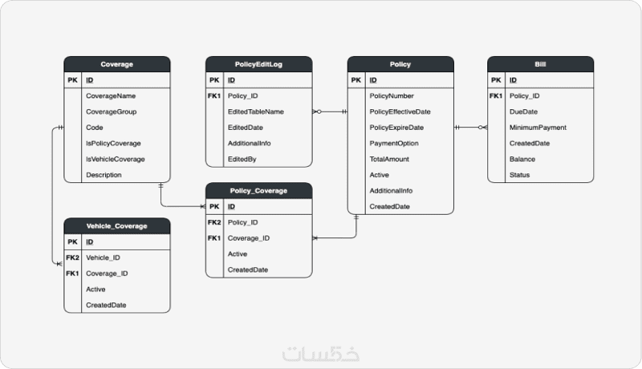
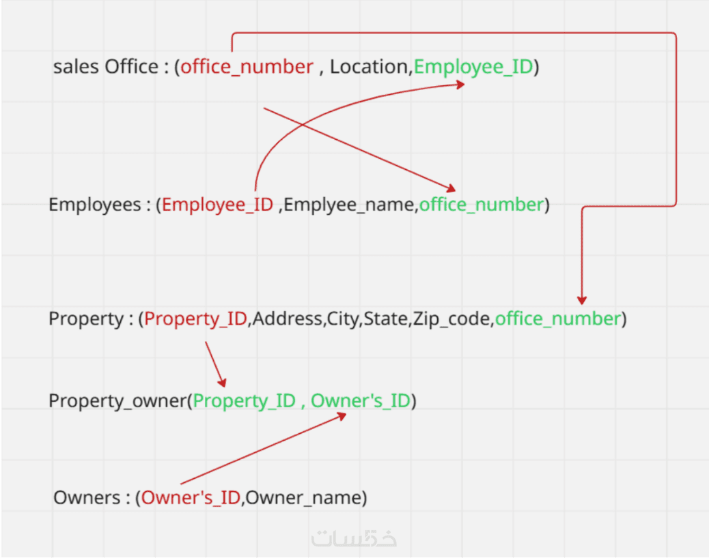
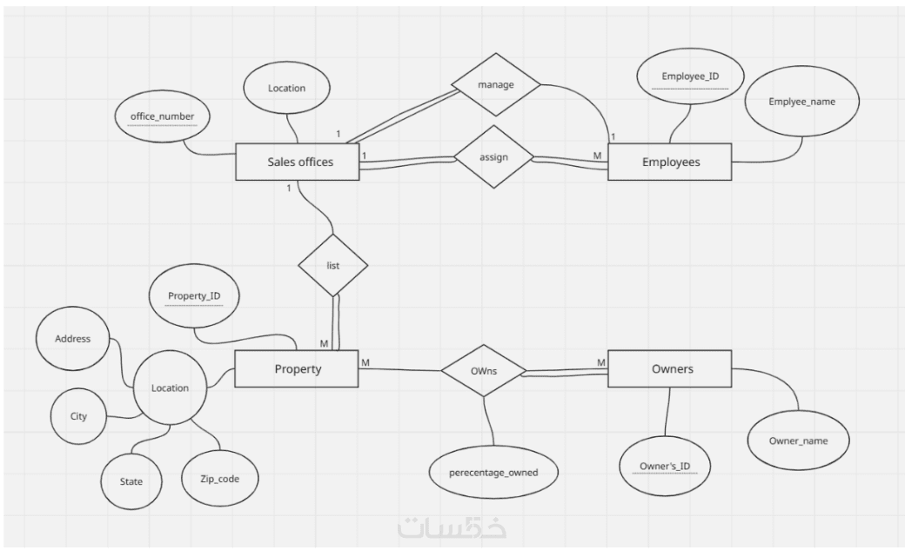
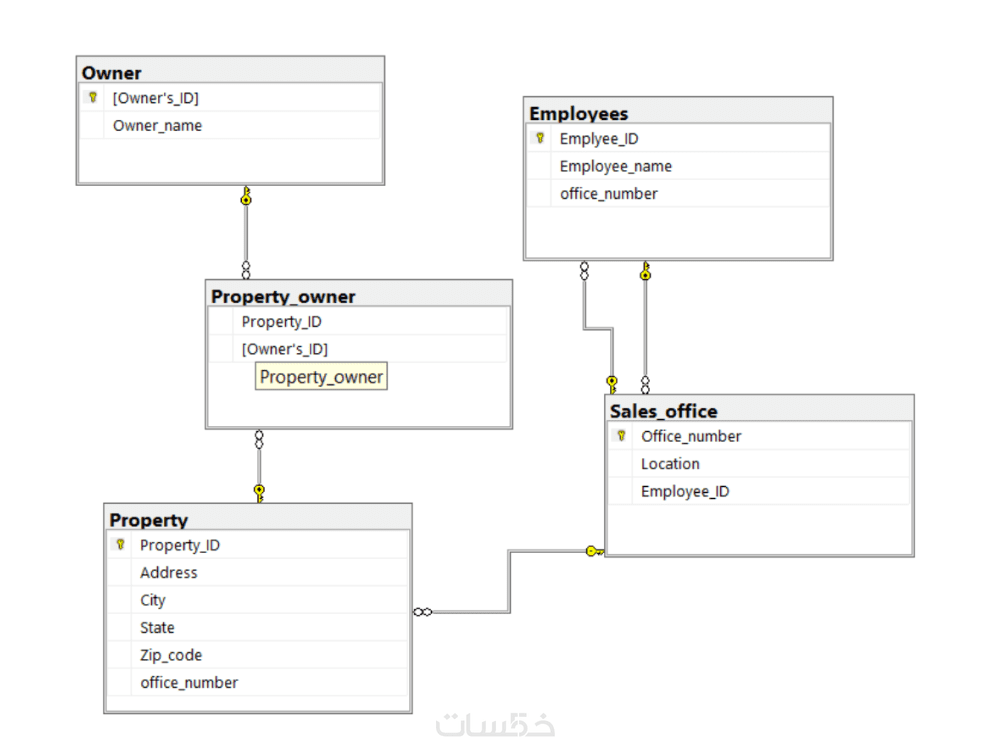
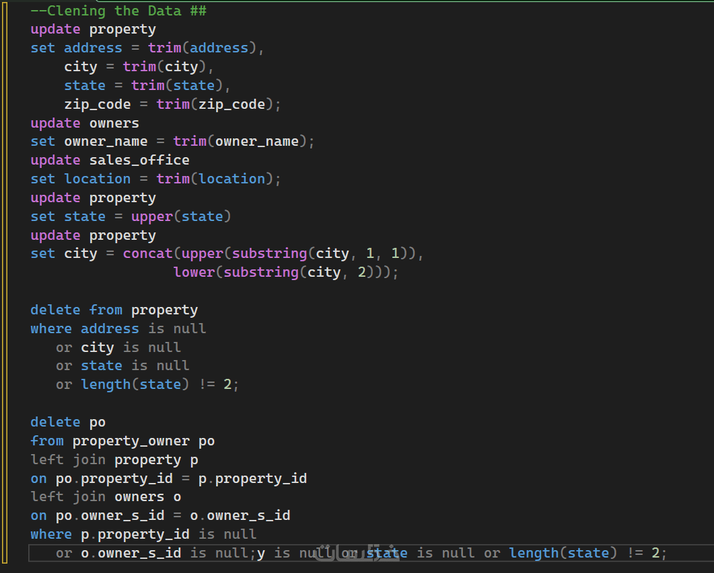

# 🗄️ Database Design & ETL Engineering Services

<div align="center">


**Professional database architecture, ERD design, SQL scripting, data cleaning, and ETL pipeline implementation.**

</div>

---

## 📋 About This Service

I offer **professional-grade ERD design and database schema architecture** to help you organize your data and manage relationships between tables efficiently. Whether you're a developer, data analyst, or student, I deliver clean, well-structured database solutions tailored to your needs.

### What's Included:
- ✅ Professional **ERD Design** with clear table relationships
- ✅ **Database Mapping** including tables, primary keys, foreign keys, and constraints
- ✅ **Data Cleaning** using SQL — removing duplicates, fixing errors, improving quality
- ✅ **ETL Pipeline** implementation (Extract → Transform → Load)

---

## 🛠️ Services Breakdown

### 1. 📐 ERD Design (Entity Relationship Diagram)

A clear and professional ERD that visualizes the structure and relationships of your database.

**Example — Insurance System ERD:**



> *Full insurance system schema including: Coverage, Policy, PolicyEditLog, Bill, Policy_Coverage, and Vehicle_Coverage tables with all foreign key relationships mapped.*

---

### 2. 🗺️ Database Mapping

Translating the ERD into a formal relational schema with clearly defined:
- Primary Keys (PK)
- Foreign Keys (FK)
- Cardinality & Relationships

**Example — Real Estate System Mapping:**



```
Sales_Office  : (office_number, Location, Employee_ID)
Employees     : (Employee_ID, Employee_name, office_number)
Property      : (Property_ID, Address, City, State, Zip_code, office_number)
Property_owner: (Property_ID, Owner's_ID)
Owners        : (Owner's_ID, Owner_name)
```

**Example — Real Estate System ERD (Chen Notation):**



**Example — Relational Model Diagram:**



---

### 3. 🧹 Data Cleaning with SQL

Cleaning and standardizing your data so it's ready for analysis or storage.

**Example — Real Estate Data Cleaning Script:**



```sql
-- Trimming whitespace from text fields
UPDATE property
SET address = TRIM(address),
    city    = TRIM(city),
    state   = TRIM(state),
    zip_code = TRIM(zip_code);

-- Standardizing state to UPPERCASE
UPDATE property
SET state = UPPER(state);

-- Proper-casing city names
UPDATE property
SET city = CONCAT(UPPER(SUBSTRING(city, 1, 1)),
                  LOWER(SUBSTRING(city, 2)));

-- Removing invalid records
DELETE FROM property
WHERE address IS NULL
   OR city IS NULL
   OR state IS NULL
   OR LENGTH(state) != 2;

-- Removing orphaned property_owner records
DELETE po
FROM property_owner po
LEFT JOIN property p ON po.property_id = p.property_id
LEFT JOIN owners o   ON po.owner_s_id  = o.owner_s_id
WHERE p.property_id IS NULL
   OR o.owner_s_id  IS NULL;
```

---

### 4. ⚙️ ETL Pipeline Implementation

Implementing **Extract, Transform, Load** operations to move and organize data within your database — ready for reporting systems or downstream analytics.

**ETL Flow:**
```
[Raw Data Source]
      ↓  Extract
[Staging / Temp Tables]
      ↓  Transform (Clean, Normalize, Join)
[Target Database / Data Warehouse]
      ↓  Load
[Analytics / Application Layer]
```

---

## 💡 Use Cases

| Use Case | Details |
|----------|---------|
| 🎓 Student Projects | Database course assignments, capstone projects |
| 💼 Business Systems | CRM, inventory, HR, billing schemas |
| 📊 Data Analysis | Structuring raw data for BI tools |
| 🔧 Software Development | Backend database layer for applications |
| 🏢 Real Estate / Insurance | Domain-specific complex schemas |

---

## 🧰 Tech Stack

| Tool | Purpose |
|------|---------|
|  | Primary RDBMS |
|  | Alternative RDBMS |
|  | ETL scripting & Pandas |
|  | Data cleaning & transformation |
| `draw.io / ERDPlus` | ERD design tools |

---

## 📁 Repository Structure

```
📦 database-design-service/
├── 📂 assets/               # ERD diagrams and screenshots
│   ├── insurance_erd.png
│   ├── db_mapping.png
│   ├── erd_chen.png
│   ├── relational_model.png
│   └── data_cleaning_sql.png
├── 📂 examples/
│   ├── 📂 insurance-system/
│   │   ├── schema.sql       # Table creation script
│   │   └── erd.png
│   └── 📂 real-estate-system/
│       ├── schema.sql       # Table creation script
│       ├── data_cleaning.sql
│       └── erd.png
└── README.md
```

---


---

<div align="center">

**⭐ If this work helped you, please star the repository!**

Made with ❤️ by **Mohamed Arafa** — Database & Data Engineering Specialist

</div>
